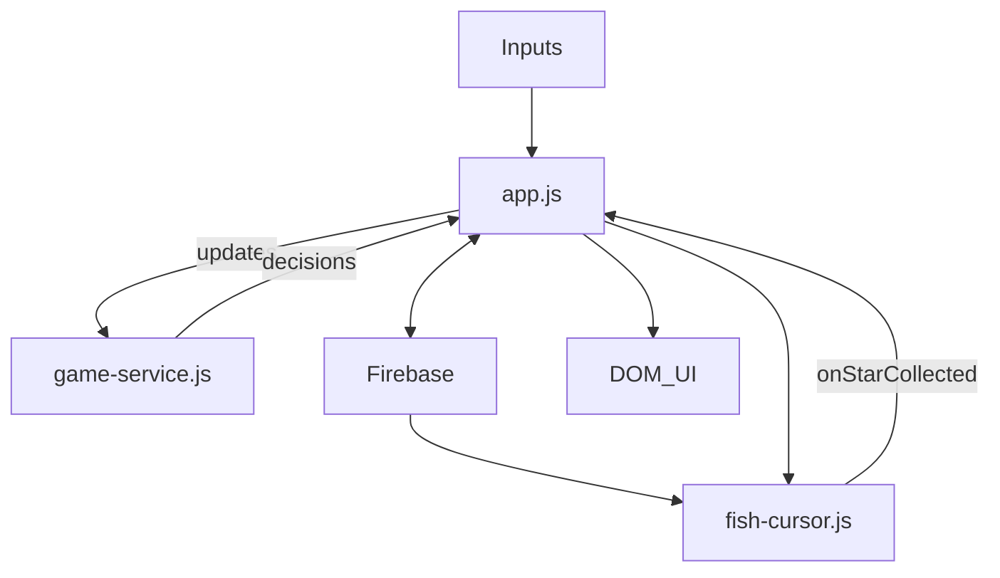

# squidly-fish-game
A cause effect fish games for Squidly platform

## System Doc

### Architecture Overview
The game is a controller-renderer system with Firebase-backed shared state.
`app.js` owns state orchestration and UI, `game-service.js` contains pure game
rules, and `fish-cursor.js` renders and simulates the 3D fish scene.

Key roles:
- `app.js`: State authority, Firebase sync, UI creation, and cursor lifecycle.
- `game-service.js`: Pure logic for stars, score, grid size, and mode changes.
- `fish-cursor.js`: WebGL renderer, animation loop, collision detection.
- `input-manager.js`: Pointer tracking for host/participant inputs.
- `squidly-apps-api.js`: Platform glue for Firebase + sidebar icons.
- `fish-cursor-config.js`: Visual tuning and game constants.

### Initialization Flow (Runtime Boot)
1. Host-only defaults: `app.js` sets initial Firebase keys if missing
   (`currentType`, `gridSize`, `score`, `gameMode`). Participants do not write.
2. Cursor setup: `window.fishGame._switchToFish()` creates `WebGLFishCursor`
   and connects the `onStarCollected` callback.
3. Input wiring:
   - Local mouse events update the active pointer (host or participant ID).
   - Squidly `addCursorListener` events update pointers from eye/mouse tracking.
4. Firebase subscriptions attach for:
   - `currentType`, `gridSize`, `score`, `gameMode`, `stars`.
5. UI creation:
   - Score overlay is injected into the DOM.
   - Multiplayer grid UI is created if the mode requires it.

### Firebase Data Model
All shared data is under `fish-game/`:
- `currentType`: active fish type (currently `fish-game/fish`).
- `gridSize`: star grid size (1-4). Drives both UI grid and star placement.
- `score`: shared score, incremented on collection.
- `gameMode`: `single-player` or `multiplayer`.
- `stars`: array of `{ id, row, col }` entries.

### Game Mode Rules (Detailed)
Single-player:
- Host controls the fish.
- Stars are auto-generated by the host when the game starts or stars are empty.
- Collision authority belongs to the controlling pointer (host in practice).

Multiplayer:
- Participant controls the fish.
- Host manages star placement via a clickable grid UI.
- Collision authority is granted only to the participant client when controlling.

Collision authority is critical: only the controlling client is allowed to
report collisions to `app.js`, which prevents score double-counting.

### State and Data Flow
`app.js` is the central controller and is the only module that writes to
Firebase in response to gameplay. `fish-cursor.js` never writes to Firebase;
it only reports collisions through a callback.

### Star Lifecycle (Step-by-Step)
1. Star generation:
   - Host calls `GameService.generateRandomStars(gridSize)` in single-player.
   - Host writes the result to Firebase at `fish-game/stars`.
2. Star sync:
   - `app.js` receives Firebase star changes and updates `firebaseStars`.
   - `app.js` calls `currentCursor.syncStarsFromFirebase(...)`.
3. Star animation:
   - `fish-cursor.js` animates stars with a float + spin effect each frame.
4. Collision:
   - Collision is a distance check between fish and star positions.
   - Only the controlling client calls `onStarCollected`.
5. Score update and removal:
   - `app.js` calls `GameService.collectStar`, updates `score`,
     and writes `score` + updated `stars` to Firebase.
6. Regeneration:
   - In single-player, host auto-regenerates when `stars` becomes empty.

### Input Arbitration (Who Controls the Fish)
Input data lands in `InputManager` under pointer IDs: `host` and `participant`.
`fish-cursor.js` decides who controls the fish each frame:
- Multiplayer: only participant pointer can move the fish.
- Single-player: participant pointer takes priority, host is fallback.

The controlling client also gains collision authority for that frame, ensuring
only one client emits `onStarCollected`.

### Rendering and Simulation Loop
The WebGL loop in `fish-cursor.js` runs every animation frame:
1. Compute delta time.
2. Select active pointer (host/participant) based on mode rules.
3. Set collision authority flag (`_isControllingFish`).
4. Update fish target position via raycast to a plane.
5. Animate fish body, fins, eyes, and color based on speed.
6. Update background particles.
7. Update stars (float, spin, twinkle) and detect collisions.
8. Render the scene.

### UI Elements and Controls
- Score display: A fixed overlay created in `app.js`.
- Star control grid: A host-only grid for star placement in multiplayer mode.
  Styles live in `style.css` under `.star-control-grid` and `.star-control-cell`.
- Sidebar controls (Squidly UI): `Grid +`, `Grid -`, and `Mode` toggle via
  `setIcon`, all writing through Firebase for sync.

### Configuration and Constants
`fish-cursor-config.js` contains tunables for:
- Fish appearance and animation (colors, scale, wiggle, smoothing).
- Particle system settings.
- Star grid sizing and star visual parameters.

### Optional Modules
- `sound-engine.js` provides audio engines but is not currently wired into the
  fish game loop.
